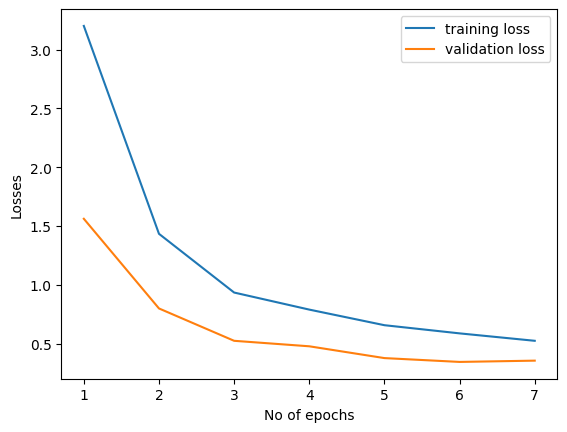

# AI Programming with Python: Image Classifier Project

This repository contains the code for an **Image Classifier** developed using **PyTorch** as part of Udacity's **AI Programming with Python Nanodegree**. The project involves building an image classifier to recognize 102 flower species and converting it into a command-line application for training and prediction.

---

## Table of Contents
- [Project Overview](#project-overview)
- [Dataset Information](#dataset-information)
- [Model Architecture](#model-architecture)
- [Training Results](#training-results)
- [Training Script (`train.py`)](#training-script-trainpy)
- [Prediction Script (`predict.py`)](#prediction-script-predictpy)
- [Requirements](#requirements)
- [Feedback and Contribution](#feedback-and-contribution)

---

## Project Overview

This project is divided into two parts:
1. **Model Training**: A pre-trained ResNet101 model is modified and trained on a dataset of 102 flower categories.
2. **Command Line Interface**: Scripts are provided to train and test the model via command-line.

The model achieves around **90% accuracy** on the test dataset after being trained for 7 epochs.

---

## Dataset Information

The dataset used for training, testing, and validation consists of 102 flower categories:

- **Training Images**: 6,552
- **Validation Images**: 818
- **Test Images**: 819

The dataset can be downloaded from this [link](https://s3.amazonaws.com/content.udacity-data.com/nd089/flower_data.tar.gz).

---

## Model Architecture

The classifier is built upon a **ResNet101** pre-trained architecture. The fully connected layer of the ResNet101 model is modified as follows:

```python
model.fc = nn.Sequential(
    nn.Linear(2048, 1024),
    nn.ReLU(),
    nn.Dropout(p=0.2),
    nn.Linear(1024, 512),
    nn.ReLU(),
    nn.Dropout(0.2),
    nn.Linear(512, num_classes)
)
```
## Training Results
Model was trained on google colab T4 GPU


The following table summarizes the training loss, validation loss, and accuracy for each epoch:

| Epoch | Training Loss | Validation Loss | Accuracy |
|-------|---------------|-----------------|----------|
| 1     | 3.2007        | 1.5619          | 60.26%   |
| 2     | 1.4341        | 0.7999          | 77.72%   |
| 3     | 0.9350        | 0.5249          | 85.07%   |
| 4     | 0.7901        | 0.4783          | 86.84%   |
| 5     | 0.6575        | 0.3780          | 89.05%   |
| 6     | 0.5881        | 0.3455          | 90.20%   |
| 7     | 0.5250        | 0.3564          | 90.66%   |

The training and validation losses are plotted below:



## Training Script (train.py)

The training script, `train.py`, allows you to train the model using command-line arguments. The script includes options to specify the architecture (ResNet or VGG), number of epochs, learning rate, and more.

### Key Features:
- **Training and Validation Transforms:** Includes random rotation, resizing, cropping, and normalization for augmentation.
- **Device Agnostic:** Automatically detects if GPU (CUDA) is available; otherwise, defaults to CPU.
- **Model Saving:** After training, a checkpoint is saved containing the model's state, architecture, and hyperparameters.

### Example Usage:

```bash
python train.py <data_directory> --save_dir <checkpoint_path> --epochs=7 --lr=0.001 --hidden_units=512 --gpu=cuda
```
#### Argument Descriptions:

- **data_directory:** Directory where the dataset is located.
- **save_dir:** Path to save the trained model checkpoint.
- **epochs:** Number of epochs for training.
- **lr:** Learning rate for the optimizer.
- **hidden_units:** Number of hidden units for the classifier.
- **gpu:** Specify whether to use CPU or GPU for training.
- **arch:** Choosing the architecture: VGG10 or RESNET101

## Prediction Script (predict.py)

The `predict.py` script allows you to use the trained model for making predictions on new images.

### Key Features:
- **Image Preprocessing:** Performs resizing, cropping, and normalization on input images.
- **Top-K Predictions:** Returns the top K most probable classes for the input image.
- **Class-to-Name Mapping:** Maps class indices to human-readable labels using a JSON file.

### Example Usage:

```bash
python predict.py <image_path> <checkpoint_path> --topk=5 --label_names=cat_to_name.json --gpu=cuda
```
#### Argument Descriptions:

- **`<image_path>`:** Path to the image to be classified.
- **`<checkpoint_path>`:** Path to the trained model checkpoint.
- **`--topk 5`:** Number of top predictions to return.
- **`--label_names cat_to_name.json`:** JSON file that maps class indices to human-readable names.
- **`--gpu cuda`:** Specify whether to use CPU or GPU for prediction.


## Requirements
The training part was done on google colaboratory. so the following as well as addition dependencies may require:

- **`python 3.10+`** 
- **`pytorch`** 
- **`torchvision`**
- **`matplotlib`**,etc.

Necessary dependencies can be installed from [Requirements file](requirements.txt)

```bash
pip install -r requirements.txt
```

## Feedback and Contribution

Thank you for checking out this project! I welcome any suggestions, feedback, or bug reports as they will help me learn and improve the project. Your input is invaluable and will contribute to making the project better for everyone.

If you have ideas for enhancements or would like to contribute, please feel free to reach out or submit a pull request. 

Happy coding and thank you for your support!

Thanks to samarekh. Some parts of the code structure, format, and overall paradigm were inspired by [samerkh/Create-Your-Own-Image-Classifier](https://github.com/samerkh/Create-Your-Own-Image-Classifier).
